# Sketch Measure React

A sketch plugin to export your designs as react applications. Quickly share design specs, css, and assets.

## Getting Started

Select an artboard in your sketch file.

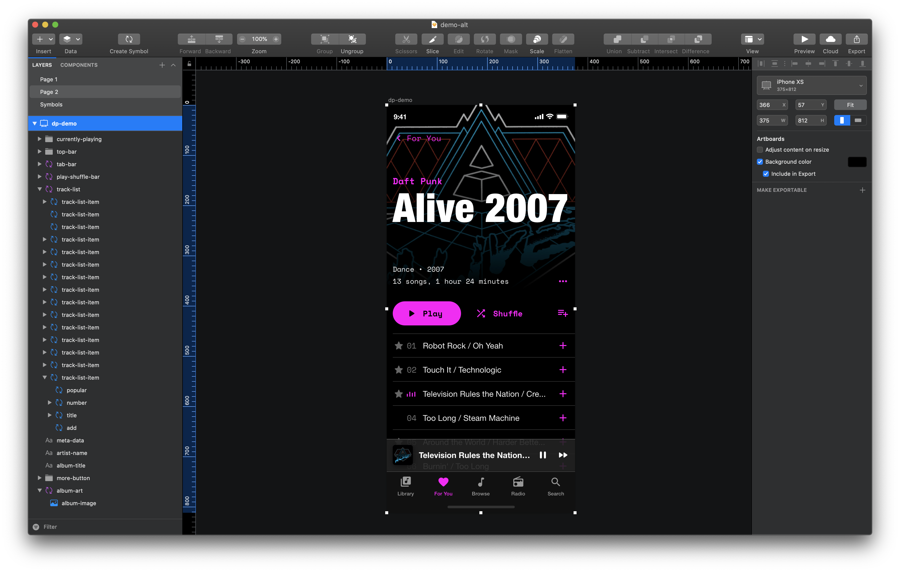

Run plugin to compose export.

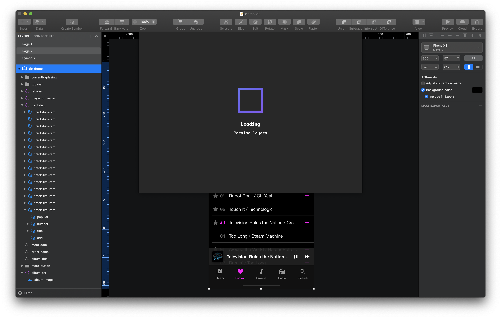

Left panel shows layers. Right panel shows CSS and notes.

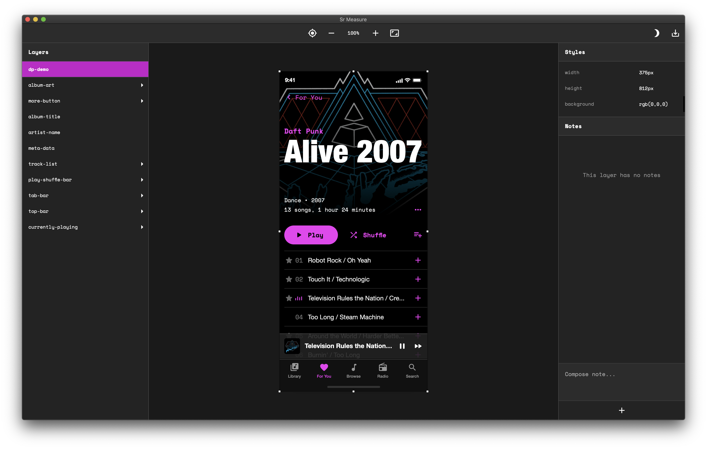

Hover over layer on the artboard or layers panel to see dimensions.

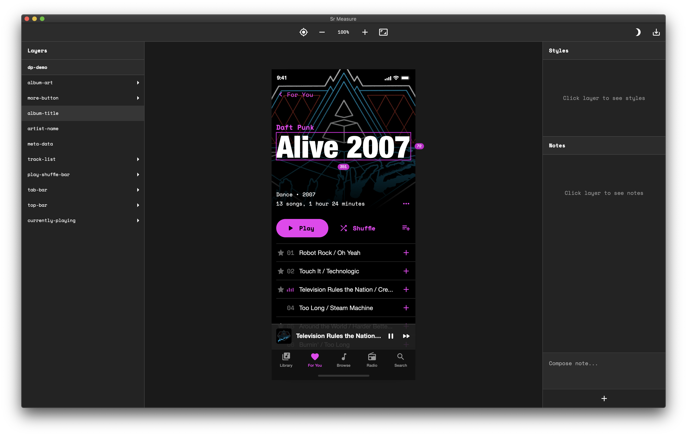

Click layer on the artboard or layers panel to select it. While selected, you can view CSS, notes, inspect assets, and hover over other layers to see relative spacing.

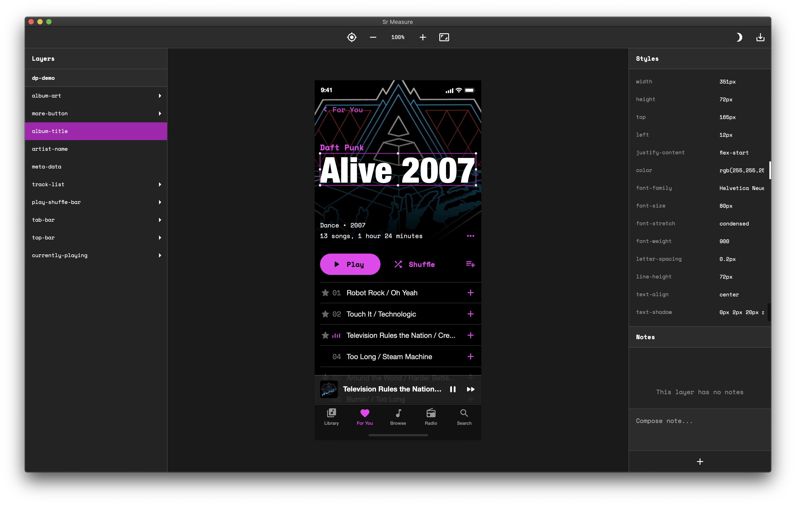
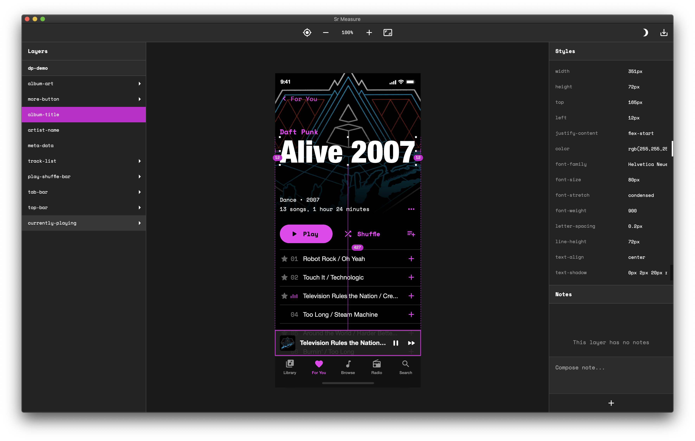

Double click groups to view group layers.

Navigate nested groups by clicking back, or double clicking a group in the layers panel.

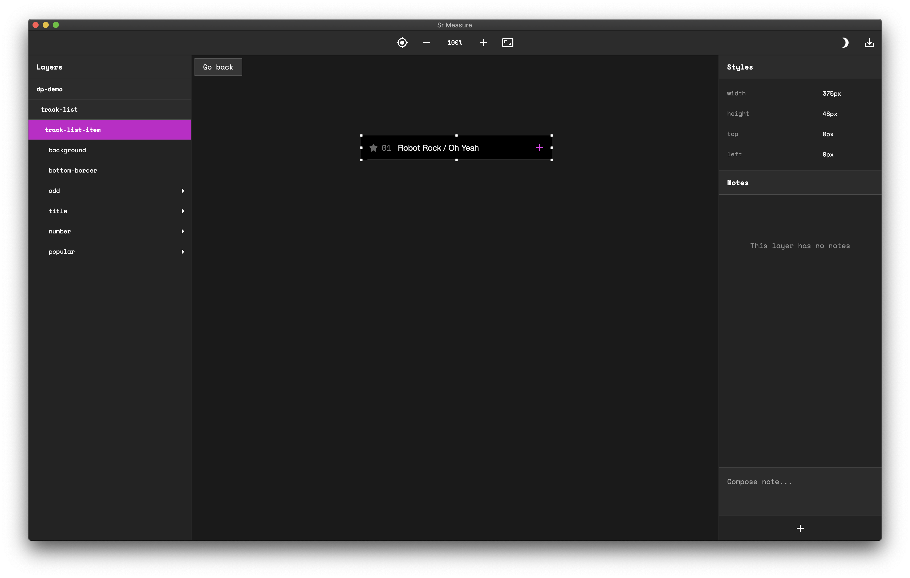

Add layer notes.

Layer note count is displayed in a circle. Nested layer note count is displayed in a square.

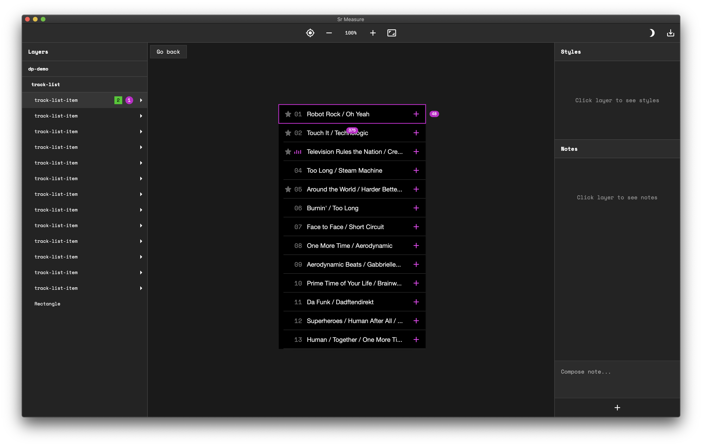

Copy CSS to clipboard.

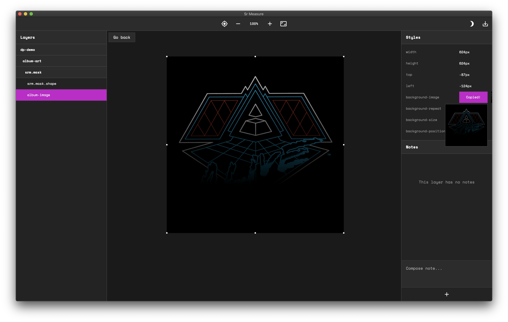

Export spec

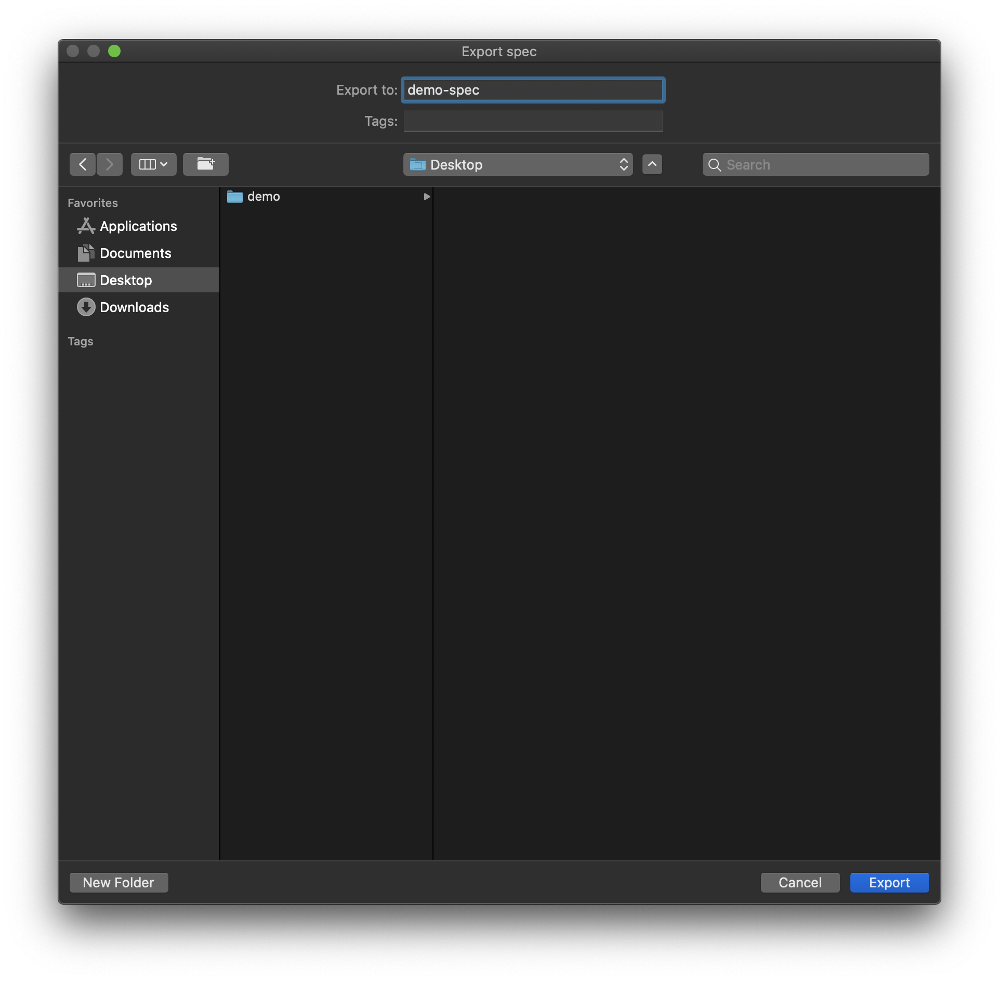

Export folder structure. Includes images (1x and 2x), svgs, and fonts used in spec.

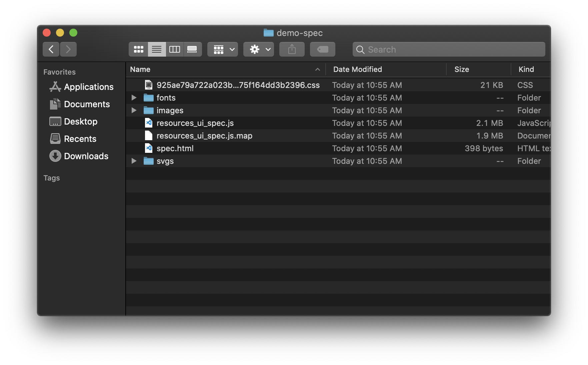

Open `spec.html` in your preferred browser to view spec.

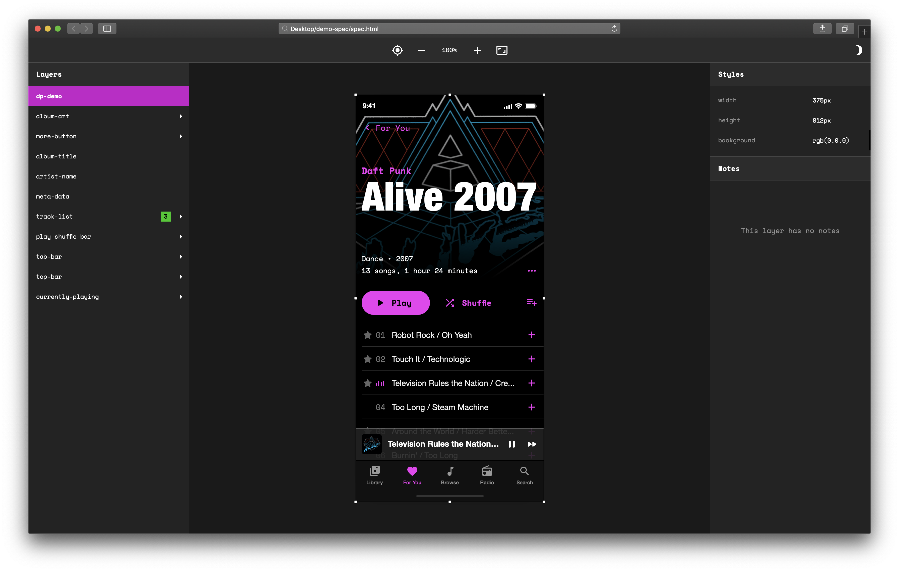

### Sketch Theme Support

Dark theme

Light theme

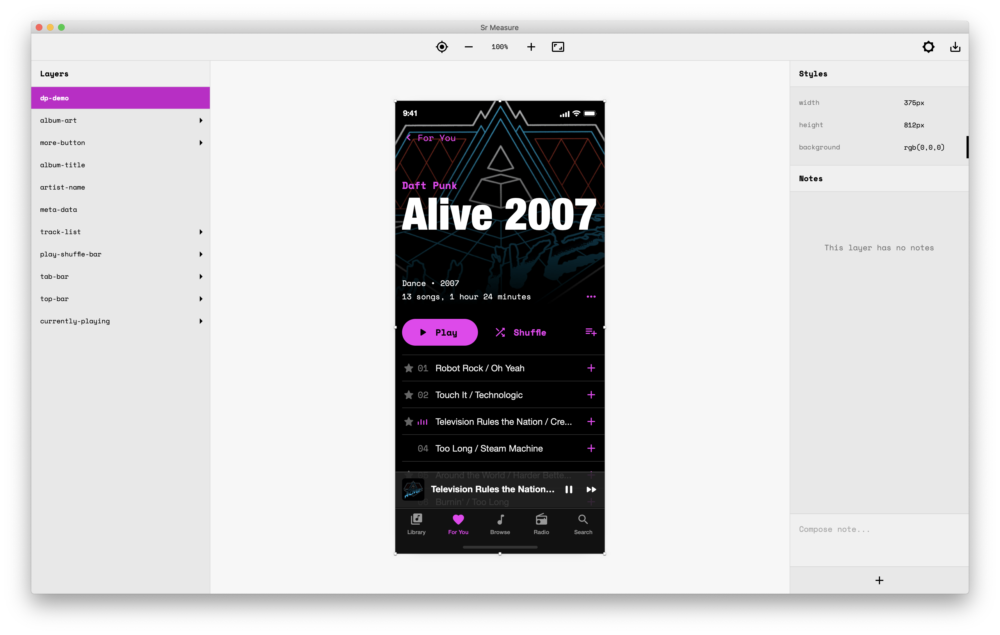

### Complex SVG Export Support

Prefix groups with `[srm.svg]` to make them an svg export (prefix will be removed from the layer name in the final spec).

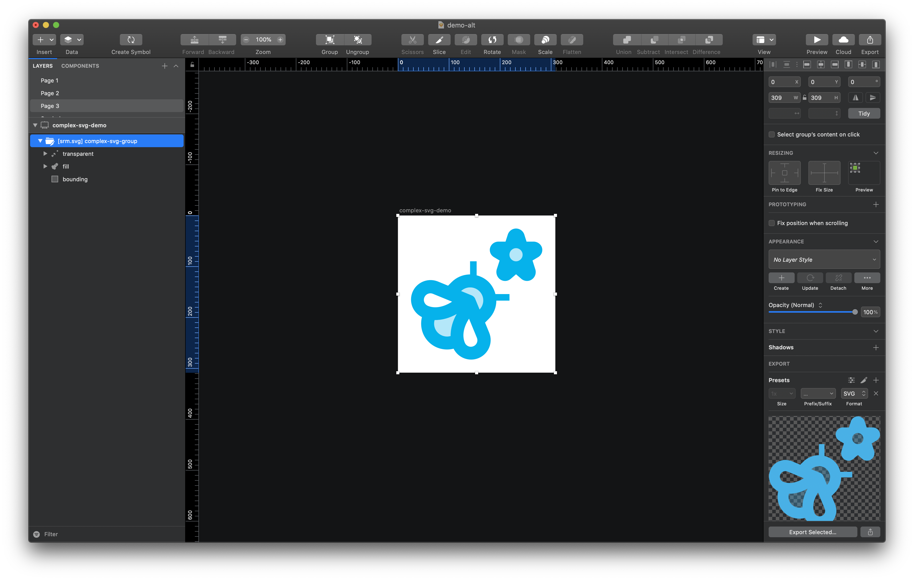

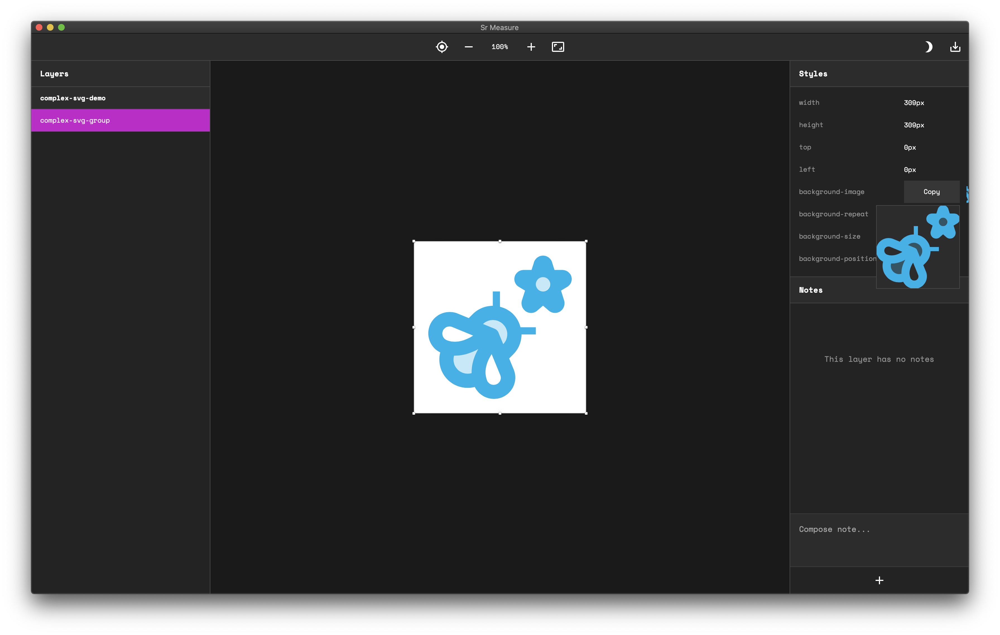

### Adaptive Rule Color

Rule and dimension color is the inverse of the average artboard color.

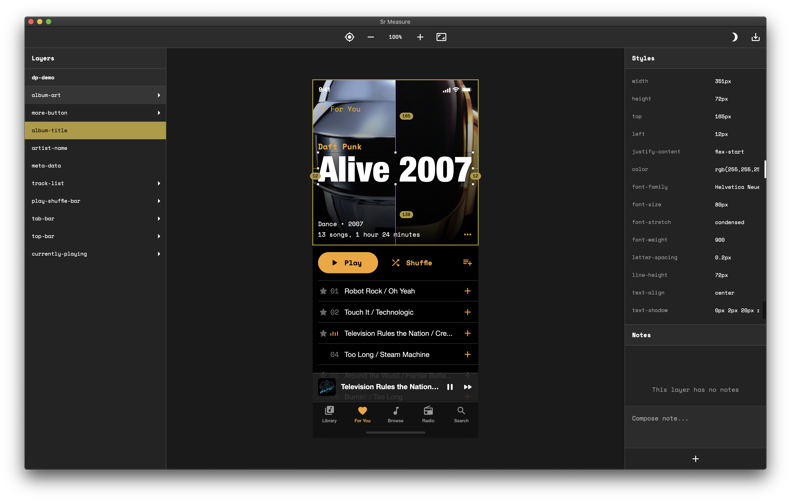

### More Details

- Max canvas size: `20,000px` by `20,000px`
- Hidden layers are not included in spec.
- Gradients are converted to images.
- Supports most masks.
- Shapes and complex ShapePaths are converted to svgs.
- Layer `Borders`, `Shadows`, and `Inner-Shadows` are combined and converted to a single css `box-shadow`.

### Key Bindings

- Zoom in: `control` `option` `command` `+`
- Zoom out: `control` `option` `command` `-`
- Re-center canvas: `control` `option` `command` `enter`
- Supports trackpad pinch zoom and mouse wheel zoom (Semi-broken on chrome. Disable native chrome pinch zoom for best results).

### Prerequisites

- Sketch: v.61.2
- Browser: Safari, Firefox, or Chrome.

### Installing

1. Download or clone repo
2. Open `sr-measure.sketchplugin`

### Firefox Masking Bug

If your design includes a complex mask (i.e. the mask shape is not an oval or rectangle), the mask and its contents will not be visible when viewing the spec on Firefox. This is due to Firefox's privacy settings. The bug only occurs when loading assets from local storage, so the CSS will still work in production. Until the bug is fixed, you should view your spec in Chrome or Safari if it includes a complex mask.

https://bugzilla.mozilla.org/show_bug.cgi?id=1565509